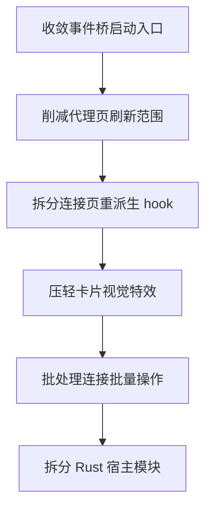

# RouteX Tauri 功能覆盖与性能风险评估

## 1. 评估范围

本次评估仅基于代码结构、迁移文档、状态管理与事件链路进行静态分析，不包含实机验证、录屏分析、FPS 采样或端到端交互压测。

目标是回答两类问题：

1. 从全局看，Electron 迁移到 Tauri 后主要功能点是否已经具备代码级闭环。
2. 在不做实机验证的前提下，哪些模块最可能导致卡片点击不顺、页面切换卡顿、事件风暴或 UI 掉帧。

## 2. 全局结论

结论分两部分：

### 2.1 功能覆盖结论

从仓库现状和迁移状态文档看，Tauri 版本已经不再是演示壳，已经具备主链路代码闭环：

1. 前端已基本完成去 Electron 化，主要业务页面通过统一桌面桥接层访问宿主能力，而不是散落使用 Electron preload。
2. Tauri 宿主已接入统一命令入口，文档显示 invoke 通道覆盖已到 `163 / 163`。
3. 主窗口、悬浮窗、托盘菜单、Mihomo 主链路、配置读写、系统能力、基础打包、首版更新链路都已有代码实现。
4. 当前最大的缺口不是功能不存在，而是仍缺少 GUI 实机回归、平台差异验证与复杂托盘体验对齐。

因此，从纯代码层判断：

- 可认为大部分核心功能点已经“能用”
- 不能认为已经“体验等价于 Electron”
- 不能认为“卡片点击、滚动、切换一定流畅”

### 2.2 性能风险结论

当前最值得关注的性能问题，不是单一大瓶颈，而是多个中等成本点叠加：

1. 高频连接与流量事件持续推送。
2. 代理页和连接页的数据派生计算仍偏重。
3. 局部组件仍在渲染阶段读取 `localStorage` 或触发额外刷新。
4. 卡片体系大量使用阴影、模糊、渐变、过渡，在 Tauri WebView 下会比 Electron 更容易放大掉帧。
5. Rust 宿主逻辑高度集中在单个 [`main.rs`](src-tauri/src/main.rs:1)，后续继续优化事件桥和窗口行为时，维护成本与回归风险都会偏高。

## 3. 功能覆盖盘点

### 3.1 已具备代码级闭环的能力

依据 [`docs/tauri-migration-status.md`](docs/tauri-migration-status.md:10) 与当前代码，可归纳为：

1. 主窗口加载与正式 React 应用入口已恢复。
2. 多入口页面存在，包含主窗口、悬浮窗、托盘菜单。
3. 配置、Profile、Override、主题、运行时文件均已接到 Tauri 宿主持久化。
4. Mihomo 启停、配置、规则、代理、Provider、日志、连接、流量事件桥已接通。
5. 系统代理、开机自启、权限检查、文件对话框、网络健康监控、图标提取、诊断快照、WebDAV 等已具备宿主实现。
6. Windows 安装产物与基础更新下载链路已存在。

### 3.2 仍不能宣称完全等价的部分

这些并不是代码缺失，而是仍处于未完全验收状态：

1. 托盘复杂动态菜单未完全复刻。
2. 托盘右键、悬浮窗、主窗口切换等交互缺少充分实机回归。
3. macOS 与 Linux 的系统代理、服务初始化、图标提取、授权、开机自启仍偏编译级确认。
4. 更新链路尚未完全收口到最终发布方案。

因此，对外表述更准确的说法应是：

- 功能主链路基本齐全
- 体验和平台一致性仍待优化与验证

## 4. 高风险交互链路评估

本次重点关注你提到的卡片点击、交互顺滑度、整体体验优化。

### 4.1 代理页是首要风险区

代理页 [`proxies.tsx`](src/renderer/src/pages/proxies.tsx:1) 已明显做了优化，例如：

1. 使用 [`react-virtuoso`](src/renderer/src/pages/proxies.tsx:12) 做虚拟列表。
2. 使用 [`useDeferredValue`](src/renderer/src/pages/proxies.tsx:11) 延迟搜索输入影响。
3. 对分块渲染组件 [`ProxyRowChunk`](src/renderer/src/pages/proxies.tsx:38) 使用 `memo`。
4. 对代理卡片 [`ProxyItem`](src/renderer/src/components/proxies/proxy-item.tsx:256) 使用定制比较函数。
5. 对分组卡片 [`ProxyGroupCard`](src/renderer/src/components/proxies/proxy-group-card.tsx:190) 使用 `memo`。

这说明项目已经识别过代理页性能问题。

但仍存在几个风险：

#### 风险 A：点击卡片会放大父级刷新

代理卡片点击最终会触发选中、测速、切换代理、刷新组数据，这些动作会回流到 [`useGroupsStore`](src/renderer/src/store/use-groups-store.ts:64) 的 `groups` 整体更新。

虽然子组件有 `memo`，但父层仍会重新生成：

1. 分组数组
2. 扁平化列表
3. chunk 数据
4. 某些闭包函数引用

这意味着代码层面已经有优化，但还不是最小更新模型。卡片点击是否流畅，很大程度取决于：一次代理变更是否导致整个组或整个页面重新派生。

#### 风险 B：分组卡片中仍有渲染期缓存读取

[`proxy-group-card.tsx`](src/renderer/src/components/proxies/proxy-group-card.tsx:47) 中仍直接使用 `localStorage` 读取图标缓存，并在 `useEffect` 中拉取远程图标后 `mutate()`。

这会带来两个问题：

1. 卡片展开或刷新时可能触发额外重渲染。
2. `mutate()` 会把图标加载与分组数据刷新耦合，可能让本该局部更新的图标加载演变成整个代理视图刷新。

这是一个典型的“功能能用，但交互平滑度会被拖慢”的点。

#### 风险 C：代理卡片视觉效果较重

[`ProxyItem`](src/renderer/src/components/proxies/proxy-item.tsx:98) 和 [`ProxyGroupCard`](src/renderer/src/components/proxies/proxy-group-card.tsx:69) 大量使用：

1. 阴影
2. 边框透明混合
3. blur 风格
4. 渐变背景
5. pressed scale 动画
6. hover shadow 变化

公共卡片样式 [`CARD_STYLES`](src/renderer/src/utils/card-styles.ts:1) 也有较重的 glass 风格。Tauri 的 WebView 在这类复合效果上的稳定性，通常不如 Electron 的 Chromium 环境宽裕，因此卡片点击压感和 hover 过渡更容易变成“略涩”而不是“顺滑”。

### 4.2 连接页是第二风险区

[`use-connections-page`](src/renderer/src/hooks/use-connections-page.ts:166) 是一个典型的重派生 hook，内部同时承担：

1. 搜索
2. 排序
3. 分组
4. 隐藏规则过滤
5. 可见区图标预加载
6. App 名称预加载
7. 时间刷新驱动

目前它已经做了部分正确优化：

1. 使用 `WeakMap` 缓存搜索文本、开始时间、连接类型。
2. 使用 `useDeferredValue` 延迟 filter、排序字段、方向、源数组。
3. 根据可视区做资源加载计划。

但仍有几个风险：

#### 风险 D：一个 hook 承担过多职责

[`use-connections-page`](src/renderer/src/hooks/use-connections-page.ts:166) 同时负责视图状态、派生计算、资源预取、批量操作与持久化。这会导致：

1. 依赖项过多
2. 某些小状态变化触发整套派生链重跑
3. 后续继续优化某一环时难以局部验证收益

它不一定现在就卡，但属于非常容易持续长胖的结构。

#### 风险 E：批量操作是串行触发

[`handleBulkAction`](src/renderer/src/hooks/use-connections-page.ts:418) 在有过滤条件时，会对 `filteredConnections` 逐条调用 [`closeConnection`](src/renderer/src/hooks/use-connections-page.ts:264)。如果连接数较大，这会导致连续 IPC 调用和连续状态震荡。

这类问题在纯代码层可以直接判断为高风险，即使还没实机测，也值得优先收敛。

### 4.3 侧边栏与信息卡是第三风险区

从搜索结果看，侧边栏多个卡片普遍使用：

1. `transition-all`
2. `backdrop-blur`
3. `animate-spin`
4. `animate-pulse`

这些点单独看问题不大，但若和：

1. 高频状态更新
2. 全局主题切换
3. 主窗口尺寸变化
4. AppSidebar 重渲染

叠加在一起，就容易在 Tauri 下产生肉眼可见的卡顿感，尤其是窄设备或窗口拖动场景。

## 5. IPC 与事件桥风险评估

### 5.1 优点

当前桥接层已经有一些明显正确的设计：

1. [`invokeSafe`](src/renderer/src/utils/ipc-core.ts:17) 统一了宿主调用封装。
2. [`startTauriMihomoEventBridge`](src/renderer/src/utils/mihomo-ipc.ts:260) 把 traffic、memory、logs、connections 拆成 WebSocket 通道。
3. 不可见窗口时跳过部分消息派发，例如 memory、logs 在 [`mihomo-ipc.ts`](src/renderer/src/utils/mihomo-ipc.ts:282) 与 [`mihomo-ipc.ts`](src/renderer/src/utils/mihomo-ipc.ts:288) 中会直接 return。
4. 连接页 store 中也会在页面不可见时跳过列表衍生计算 [`use-connections-store.ts`](src/renderer/src/store/use-connections-store.ts:106)。
5. 代理组轮询已降低到 30 秒，更多依赖事件触发 [`use-groups-store.ts`](src/renderer/src/store/use-groups-store.ts:117)。

这些设计说明目前不是“完全无防护”的状态。

### 5.2 主要风险点

#### 风险 F：事件桥启动入口分散

[`startTauriMihomoEventBridge`](src/renderer/src/utils/mihomo-ipc.ts:260) 被多个位置重复触发：

1. [`App.tsx`](src/renderer/src/App.tsx:13)
2. [`use-connections-store.ts`](src/renderer/src/store/use-connections-store.ts:237)
3. [`mihomo-ipc.ts`](src/renderer/src/utils/mihomo-ipc.ts:173)
4. 配置变更监听链路 [`mihomo-ipc.ts`](src/renderer/src/utils/mihomo-ipc.ts:178)

虽然函数内部会关闭旧 socket 再重连，但这种“多入口重复起桥”的模式，仍然会造成：

1. 连接重建次数偏多
2. 某些配置变化放大为全桥重启
3. 排查偶发卡顿时很难确认是谁触发了桥重置

这是很典型的结构性成本点。

#### 风险 G：连接快照更新仍然偏重

[`use-connections-store`](src/renderer/src/store/use-connections-store.ts:95) 每次收到连接快照时会：

1. 广播快照
2. 计算速度
3. 构建 `prevActiveMap`
4. 生成 `newActive`
5. 生成 `newlyClosed`
6. 更新 store

虽然已有对象复用逻辑，但这仍然是按全量快照派生的模型，不是增量 patch 模型。连接数一多，Tauri WebView 更容易出现 JS 主线程持续忙碌。

#### 风险 H：资源加载仍可能与列表更新叠加

[`use-resource-queue`](src/renderer/src/hooks/use-resource-queue.ts:140) 已做可视区分级队列、内存缓存与批量限制，这部分方向是对的。

但它仍会在连接列表变化时继续做：

1. 图标请求队列推进
2. appName 请求队列推进
3. `setIconMap`
4. `setAppNameCache`

如果连接事件频繁、可视区变化快、图标命中率又不高，就会和列表渲染形成耦合抖动。

## 6. 优化优先级建议

以下优先级基于“纯代码收益最大化”和“对当前体验最可能立竿见影”的原则。

### P0：先做，最可能改善卡顿体感

1. 收敛事件桥生命周期
   - 为 [`startTauriMihomoEventBridge`](src/renderer/src/utils/mihomo-ipc.ts:260) 建立单一所有者
   - 避免在 [`App.tsx`](src/renderer/src/App.tsx:13) 与 store 中重复启动
   - 将配置变化导致的重连改成更细粒度判定

2. 降低代理页点击后的全局刷新范围
   - 把图标加载从 [`proxy-group-card.tsx`](src/renderer/src/components/proxies/proxy-group-card.tsx:47) 中剥离
   - 禁止图标拉取后调用整个 `mutate()`
   - 让代理切换后只刷新受影响组，而不是整页派生链都重建

3. 拆分 [`use-connections-page`](src/renderer/src/hooks/use-connections-page.ts:166)
   - 至少拆成 视图状态、数据派生、资源预取 三层
   - 减少单个状态变化触发整套逻辑重算

4. 压轻卡片视觉特效
   - 先从 [`CARD_STYLES`](src/renderer/src/utils/card-styles.ts:1) 入手
   - 减少 hover shadow 和 blur 的叠加
   - 避免大量 `transition-all`

### P1：第二批，稳定降低 CPU 与 UI 抖动

1. 连接快照改为更强的增量复用策略
   - 在 [`use-connections-store`](src/renderer/src/store/use-connections-store.ts:95) 中减少全量对象重建
   - 评估只对可见区或变化连接做二次派生

2. 批量连接操作加节流或批处理
   - 优化 [`handleBulkAction`](src/renderer/src/hooks/use-connections-page.ts:418)
   - 避免对大量连接逐条触发 IPC

3. 统一本地图标缓存策略
   - 把代理组图标缓存逻辑与连接图标缓存逻辑统一到 [`use-resource-queue`](src/renderer/src/hooks/use-resource-queue.ts:140) 或独立缓存层
   - 避免组件内直接读写 `localStorage`

4. 继续减少不可见窗口期间的计算
   - 当前已有基础策略，但还可继续检查连接页、侧边栏卡片、统计页是否有隐藏窗口下仍工作的定时器

### P2：第三批，结构性治理

1. 将 [`src-tauri/src/main.rs`](src-tauri/src/main.rs:1) 拆分为领域模块
   - windows
   - tray
   - updater
   - mihomo
   - system
   - storage

2. 建立统一的性能观测点
   - 连接快照处理耗时
   - 代理页重渲染次数
   - 资源队列命中率
   - 事件桥重连次数

3. 为关键页面建立静态性能规则
   - 禁止组件渲染期直接读写 `localStorage`
   - 高频列表组件禁用非必要 blur 和重阴影
   - 高频数据页必须有虚拟化或可视区派生策略

## 7. 建议实施顺序

## 8. 建议的执行 todo

1. 抽离并统一 Tauri Mihomo 事件桥生命周期管理。
2. 重构代理页图标加载与分组刷新关系，去掉图标加载触发全局 `mutate`。
3. 拆分连接页 hook，隔离搜索排序、可见区资源预取、界面状态。
4. 为连接批量关闭与批量隐藏增加批处理或节流。
5. 下调高频卡片组件的 blur、shadow、transition 成本。
6. 为关键列表页加入最小性能埋点，记录事件桥重连与大列表处理耗时。
7. 逐步拆分 Tauri 宿主超大 [`main.rs`](src-tauri/src/main.rs:1) 为领域模块。

## 9. 面向你当前目标的最终判断

如果你的目标是：

- 从全局看功能点是否可用
- 判断迁移后项目是否值得进入优化阶段

那么答案是：

1. 可以，当前 Tauri 版本从代码层看已经具备进入“体验优化阶段”的条件，不再是缺功能阶段。
2. 当前最值得优化的不是新增功能，而是代理页、连接页、事件桥生命周期与卡片视觉成本。
3. 卡片点击是否流畅，纯代码层无法给出绝对结论，但从现状看，代理页卡片和连接页列表是最可能出现不顺滑感的地方。
4. 如果只允许优先做一轮优化，建议先做 P0 四项，它们最可能直接提升你能感知到的顺滑度。

## 10. 本轮已落地项与延后项

### 10.1 本轮已落地项

本轮按“最小闭环、避免与现有 bridge 修复计划重叠”的原则，先落地了代理页图标去耦与卡片样式压轻两项。

1. 代理页图标加载去耦
   - 已调整 [`proxy-group-card.tsx`](src/renderer/src/components/proxies/proxy-group-card.tsx:1)
   - 将图标加载后的更新范围收敛到组件局部 state，不再通过全局 `mutate()` 触发整页刷新
   - 同时避免在渲染表达式里直接读取 `localStorage`，减少卡片展开与列表刷新时的额外抖动

2. 高频卡片样式温和降级
   - 已调整 [`card-styles.ts`](src/renderer/src/utils/card-styles.ts:1)
   - 下调了 [`INACTIVE`](src/renderer/src/utils/card-styles.ts:14)、[`GLASS_TOOLBAR`](src/renderer/src/utils/card-styles.ts:17)、[`GLASS_CARD`](src/renderer/src/utils/card-styles.ts:45) 等样式的 blur、shadow 与 hover 成本
   - 目标不是改视觉方向，而是在 Tauri WebView 下减少 glass 叠层导致的 hover/点击发涩感

### 10.2 本轮明确延后项

1. 事件桥生命周期收敛
   - 仍然重要，但当前 [`mihomo-ipc.ts`](src/renderer/src/utils/mihomo-ipc.ts:1) 已有 `version/controller` 级保护，且仓库里已有单独修复计划在推进
   - 在这个评估计划里继续深入，容易与现有 bridge 最小修复任务重叠，因此本轮不重复展开

2. 拆分 [`useConnectionsPage`](src/renderer/src/hooks/use-connections-page.ts:166)
   - 该 hook 当前同时负责视图状态、数据派生、资源预取、批量操作与持久化，不适合在本轮作为顺手优化直接拆
   - 原因不是它不值得做，而是它属于“结构重构”而不是“低风险即刻优化”
   - 建议后续单开任务，按“视图状态 / 列表派生 / 资源预取”三层拆分，并配合页面回归验证一起做

### 10.3 更新后的执行建议

如果继续推进，建议顺序调整为：

1. 已完成：代理页图标去耦
2. 已完成：卡片视觉效果压轻
3. 下一步：单独处理事件桥生命周期收敛
4. 再下一步：单开任务拆分 [`useConnectionsPage`](src/renderer/src/hooks/use-connections-page.ts:166)
5. 之后再做连接批量操作批处理与性能埋点
